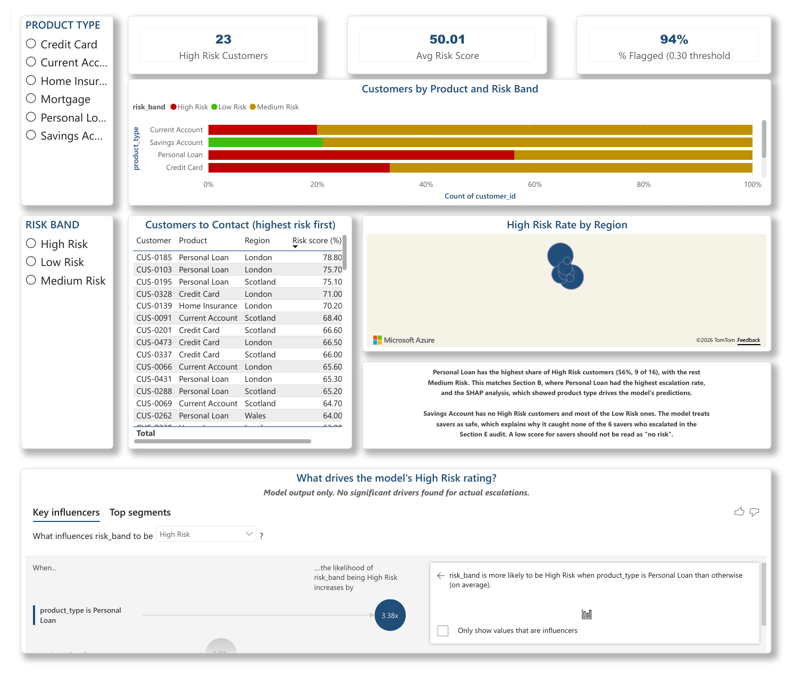
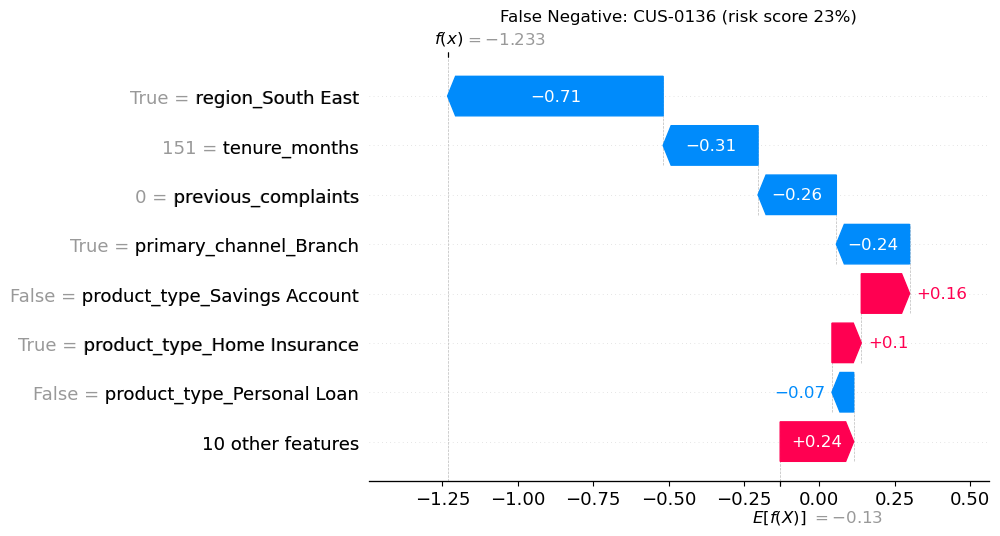
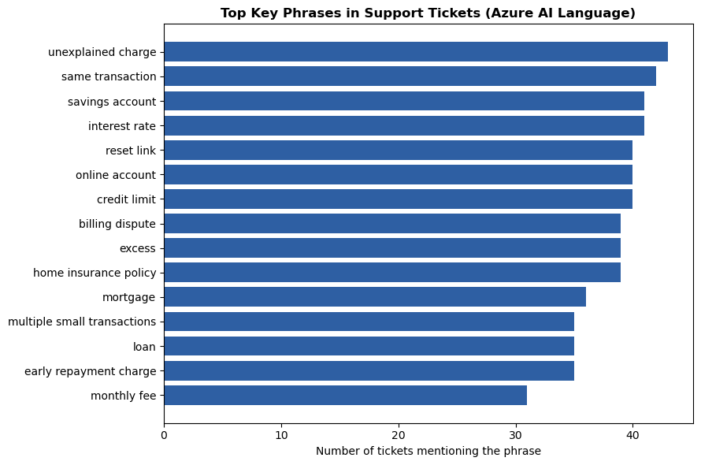
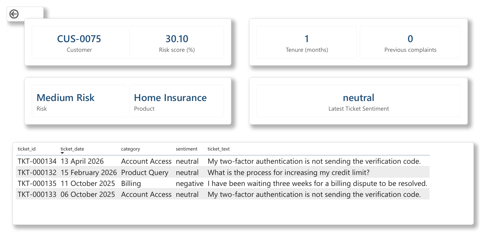

# Meridian Financial – Customer Intelligence with AI, ML & NLP

**Predicting complaint escalation, understanding customer sentiment, and auditing the model for fairness before deployment.**




---

## The business problem

Meridian Financial (a fictional UK financial services firm) loses money and customer trust every time a complaint escalates. A missed escalation costs about **£800**. A proactive courtesy call costs about **£25**.

The question: **can we predict which customers are likely to escalate, so the Complaints team can call them first, and can we do it fairly?** Under the FCA's Consumer Duty, a model that treats customers differently because of age, ethnicity or other protected characteristics is not acceptable, however accurate it is.

## What I built

| Step | What it does | Tools |
|---|---|---|
| **1. Problem framing** | Defined intended and prohibited uses, protected characteristics and proxies, a human-in-the-loop process, and the cost of each error type | Markdown |
| **2. Exploratory analysis** | Merged customer and outcome data; analysed escalation by product, complaint history and age band | pandas, matplotlib, seaborn |
| **3. Escalation risk model** | Logistic regression with class balancing; threshold tuned on business cost, not accuracy | scikit-learn |
| **4. Bias audit** | Recall and false positive rate by age band at two thresholds | pandas |
| **5. Explainability** | Global and individual SHAP explanations, translated into plain English | SHAP |
| **6. NLP on 919 support tickets** | Sentiment analysis and key phrase extraction | Azure AI Language |
| **7. Dashboard** | 4-page Power BI report for operations, CX and Compliance, with drill-through, an AI visual and row-level security | Power BI, DAX, Azure Maps |
| **8. Governance** | AI Reflection and a one-page Responsible AI Summary for the Head of Compliance | Word |

## Key findings

### 1. The model is not good enough to deploy, and the analysis shows why
- **AUC 0.53**: if you pick one customer who escalated and one who didn't, the model ranks them correctly only 53% of the time, barely better than a coin toss.
- Because a missed escalation costs 32× more than a call, I lowered the threshold to **0.30**. It then catches **25 of 27** escalations (93%), but flags 94 of 100 customers. At that point, calling everyone is simpler and just as cheap.

### 2. Age was excluded, but the model still treats age groups differently
At the default 0.50 threshold, the 36–45 group had the highest escalation rate (41%) but the lowest recall (44%), while 56–65 customers were wrongly flagged 64% of the time. Excluding a protected characteristic is not enough when other columns act as proxies for it.

### 3. Region looks like a proxy
Region accounts for 5 of the top 12 SHAP drivers, and 17 of the 23 High Risk customers are in London or Scotland. One escalating customer was missed almost entirely because they live in the South East:



### 4. What customers are actually saying
- Tickets are overwhelmingly negative: **68% negative, under 2% positive**.
- Negativity is range-bound at **58–77% each month**, with no improving trend; review ratings hold steady at about 3.5 stars.
- **Billing, Refund Request and Service Failure** tickets are almost entirely negative. "Unexplained charge" is the top key phrase. Fixing billing errors and account access would have the biggest impact.



## Recommendation

**Not ready to deploy.** Conditions before any use:
1. Every flag is reviewed by a person before a customer is contacted.
2. Region is tested and removed if it drives unfair outcomes.
3. A bias report is produced every quarter.

The model must **never** be used to refuse, price, restrict or withdraw any product or service.

## Dashboard

| Page | Audience | What it shows |
|---|---|---|
| Escalation Risk Overview | Customer Ops | KPIs, risk by product, map of high-risk rate by region, ranked contact list, Key Influencers (AI visual) |
| Customer Detail (drill-through) | Customer Ops | Individual risk score, tenure, complaints, latest ticket sentiment, ticket history |
| Sentiment and NLP Themes | Head of CX | Negativity trend, sentiment by category, top key phrases, review rating trend |
| Responsible AI Monitoring | Head of Compliance | Fairness audit by age band, recall vs escalation rate, SHAP importance, compliance statement |

Row-level security: the **CX Team** role sees only flagged customers; the **Compliance** role sees everything.



## Responsible AI decisions

- **Age band excluded** from the model (a protected characteristic under the Equality Act 2010) and used only to audit fairness.
- **Churn, NPS and 12-month complaint count excluded**, because they are only known after the event and would leak the answer.
- **Region and contact channel kept but flagged** as possible proxies for ethnicity and age.
- **Azure key entered at runtime** with `getpass`; it is never stored in the notebook or this repository.

## What I would do next

Retrain with age band still excluded and **tenure and region also removed**, then compare fairness and accuracy side by side. Add individual-level signals, such as ticket sentiment, as model inputs.

## Repository contents

```
├── meridian_project.ipynb          # Full analysis, Sections A–H
├── meridian_customers.csv          # Source data (course-provided, fictional)
├── meridian_outcomes.csv
├── meridian_tickets.csv
├── meridian_reviews.csv
├── meridian_ml_output.csv          # Model output: risk score, band, flag per customer
├── meridian_nlp_output.csv         # Sentiment per ticket from Azure AI Language
├── dashboard/
│   └── meridian_dashboard.pbix     # Power BI report
├── docs/
│   └── Meridian_Module5_Written_Submission.docx
└── images/                         # Charts used in this README
```

## How to run

1. Clone the repo and open `meridian_project.ipynb` in Jupyter.
2. `pip install pandas numpy scikit-learn shap matplotlib seaborn azure-ai-textanalytics`
3. Section D needs your own Azure AI Language resource (Free F0 tier). Paste your key when prompted.
4. Open `dashboard/meridian_dashboard.pbix` in Power BI Desktop. Use **Modeling → View as** to test the two roles.

---

*Built by **Raphael Ehis Akhigbe** as the Module 5 (AI-900) project on the Data Analyst Career Programme. The data is fictional and was provided for training.*
